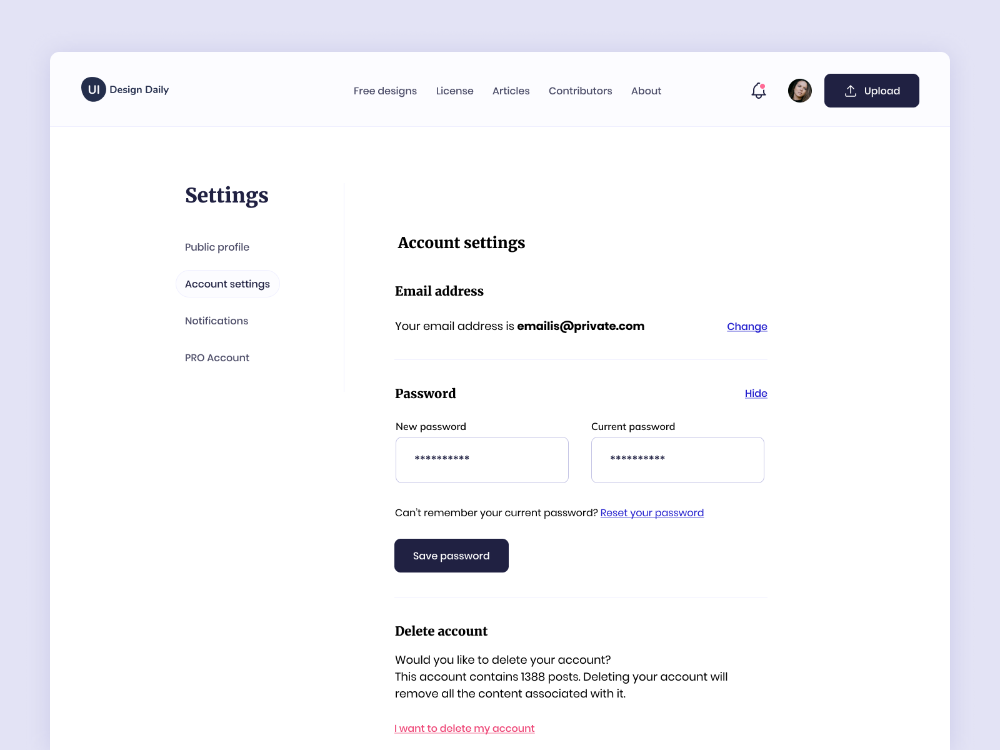

# Título do Projeto

# Sobre o Projeto

O projeto é referente a matéria de Usabilidade, desenvolvimento web, mobile e jogos.Foi proposto, como avaliação prática, a implementação de Interfaces Web. 

A interface feita nesse projeto foi a tela de configuração de conta. A ideia é que a implementação da tela seja o mais fiel possível ao protótipo de tela fornecido pelo professor.

O protótipo está disponivel [nesse link](https://uidesigndaily.com/posts/figma-account-settings-form-day-1388).

# Índice/Sumário

* [Sobre](#sobre-o-projeto)
* [Sumário](#índice/sumário)
* [Requisitos Funcionais](#requisitos-funcionais)
* [Tecnologias Usadas](#tecnologias-usadas)
* [Contribuição](#contribuição)
* [Autores](#autores)
* [Licença](#licença)
* [Agradecimentos](#agradecimentos)

# Requisitos Funcionais 

- [x] **botão de Upload**
- [x] **Menu de navegação**
- [x] **Header completo**
- [x] **Menu com opções de configuração**
- [x] **Tela de configuração da conta, com formulário**

# Tecnologias Usadas

- [HTML](https://developer.mozilla.org/pt-BR/docs/Web/HTML)
- [CSS](https://developer.mozilla.org/pt-BR/docs/Web/CSS)

# Contribuição

Leia o arquivo [CONTRIBUTING.md](CONTRIBUTING.md) para saber detalhes sobre o nosso código de conduta e o processo de envio de solicitações *pull* (*Pull Request*) para nós.

# Autores

<table>
  <tbody>
    <tr>
    <td align="center">
	  	<a href="https://kentcdodds.com">
			
			 
			<b>Anne K. F. Carmo</b>
		</a>
		 
		<a href="https://github.com/testing-library/react-testing-library/commits?author=kentcdodds" title="Code">💻</a>
	</td>
    </tr>
	</tbody>
<table>

# Licença

Este projeto está licenciado sob a Licença MIT,  consulte o arquivo [LICENSE.md](LICENSE.md) para mais detalhes.

# Agradecimentos

Agradeço ao professor Diego, por compartilhar o seu conhecimento com os alunos, com muita dedicação e empenho.